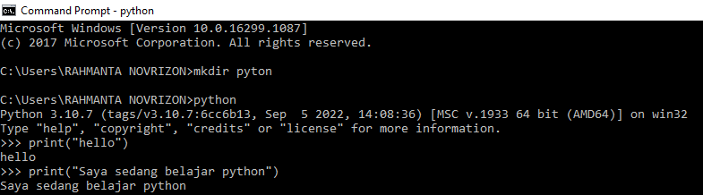

# Latihan 1

#### - Menjalankan Python Console
#### - Menampilkan tulisan “Hello” dilayar
#### - Menampilkan tulisan “Saya sedang belajar python” dilayar

# Latihan 2

#### - Menjumlahkan dua buah bilangan menggunakan variabel a dan b.
#### - Mendefinisikan variable a dengan nilai 8
#### - Mendefinisikan variable b dengan nilai 6
#### - Mencetak nilai variable a dan b
#### - Mencetak hasil penjumlahan a+b

# Latihan 3

#### - Menjalankan IDLE
#### - Membuat file baru dengan nama latihan3.py (pastikan lokasi file pada folder lab2py pada direktori kerja anda)
#### - Menggunakan fungsi input untuk mengambil nilai variabel dari keyboard.

## Pycharm
#### - https://www.jetbrains.com/pycharm/

## Virtual Environment (Venv)

## Menambahkan File Baru
#### - main.py

## Menjalankan Program

